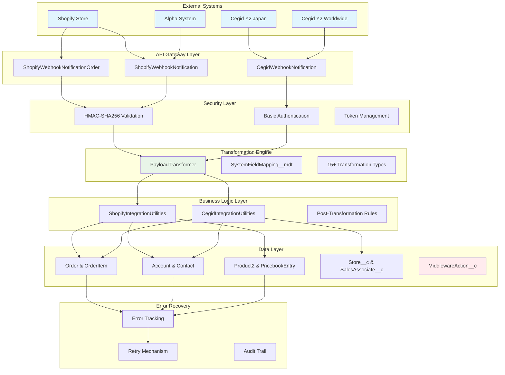

## System Architecture

The AmiParis Order Processing System is a sophisticated, **webhook-driven integration platform** that enables real-time synchronization between multiple external systems and Salesforce.

<CardGroup cols={2}>
  <Card title="External Systems" icon="plug">
    **4 Connected Systems**
    - Shopify Ami Paris (E-commerce)
    - Cegid Y2 Japan (POS/ERP)
    - Cegid Y2 Worldwide (POS/ERP) 
    - Alpha System (Future expansion)
  </Card>
  <Card title="Integration Pattern" icon="arrows-rotate">
    **Event-Driven Architecture**
    - Real-time webhook processing
    - Asynchronous error recovery
    - Bidirectional synchronization
    - Metadata-driven transformation
  </Card>
</CardGroup>

## High-Level Architecture

## Integration Patterns

### 1. Webhook-Driven Processing

<Tabs>
<Tab title="Shopify Pattern">
  **Real-time E-commerce Events**
  
  <Steps>
  <Step title="Webhook Trigger">
    Shopify sends webhook on order/customer events
  </Step>
  <Step title="HMAC Validation">
    Cryptographic signature verification for security
  </Step>
  <Step title="Immediate Processing">
    Synchronous transformation and database operations
  </Step>
  <Step title="Success Response">
    Quick acknowledgment to prevent webhook retries
  </Step>
  </Steps>
</Tab>

<Tab title="Cegid Pattern">
  **API-First Integration**
  
  <Steps>
  <Step title="Webhook Notification">
    Minimal notification with entity ID and operation
  </Step>
  <Step title="Full Data Retrieval">
    HTTP GET to Cegid API for complete entity data
  </Step>
  <Step title="Transformation">
    Same PayloadTransformer engine as Shopify
  </Step>
  <Step title="Entity-Specific Rules">
    Custom business logic per entity type
  </Step>
  </Steps>
</Tab>
</Tabs>

### 2. Metadata-Driven Transformation

<Warning>
**Core Innovation**: All field mappings and business logic are configurable through custom metadata, enabling changes without code deployment.
</Warning>

**SystemFieldMapping__mdt Configuration**:
- **ExternalApiPath__c**: JSON path extraction patterns
- **SalesforceField__c**: Target Salesforce field mapping
- **TransformationLogic__c**: Business rule application (15+ types)
- **TranscodificationJSON__c**: Value mapping and translation

## Component Layers

### API Gateway Layer

<AccordionGroup>
<Accordion title="ShopifyWebhookNotificationOrder.cls">
  **Order Processing Handler**
  - HMAC-SHA256 security validation
  - Complex order + order items workflow
  - Refund and return logic support
  - Multi-system integration bridge
</Accordion>

<Accordion title="ShopifyWebhookNotification.cls">
  **Customer Synchronization**
  - Customer data from Shopify API
  - Email-based deduplication
  - Person Account management
  - Contact relationship handling
</Accordion>

<Accordion title="CegidWebhookNotification.cls">
  **Multi-Entity Processing**
  - Entity type detection and routing
  - Basic authentication validation
  - Tenant-based credential management
  - Bridge to specialized utilities
</Accordion>
</AccordionGroup>

### Transformation Engine

**PayloadTransformer.cls** - The system's heart

<CardGroup cols={3}>
  <Card title="Text Operations" icon="text">
    - Direct mapping
    - Concatenation
    - Case conversion
    - Constant values
  </Card>
  <Card title="Business Logic" icon="brain">
    - Order status calculation
    - Customer categorization
    - Store type classification
    - Geographic handling
  </Card>
  <Card title="Data Processing" icon="database">
    - Date/time conversion
    - Numerical operations
    - Array processing
    - JSON path extraction
  </Card>
</CardGroup>

### Business Logic Layer

<Tabs>
<Tab title="ShopifyIntegrationUtilities">
  **Order & Account Processing**
  - Account external ID resolution
  - Multi-currency pricebook management
  - Product auto-creation logic
  - Store and sales associate assignment
</Tab>

<Tab title="CegidIntegrationUtilities">
  **Multi-System API Integration**
  - Account, Store, SA, Order processing
  - Complex relationship resolution
  - API credential management
  - Error handling and retry logic
</Tab>
</Tabs>

## Data Model Integration

### Core Salesforce Objects

<Tabs>
<Tab title="Order Management">
  **Order & OrderItem Objects**
  - External ID-based upserts prevent duplicates
  - Multi-currency support via Pricebook2Id
  - Complex status calculation (paid/refunded/returned)
  - Audit trail via MiddlewareAction__c
</Tab>

<Tab title="Customer Management">
  **Account & Contact Objects**
  - Person Account pattern for B2C customers
  - Email-based deduplication logic
  - Customer categorization (VIP/EMPLOYEE/PRESS/CUSTOMER)
  - Store and sales associate relationships
</Tab>

<Tab title="Product Management">
  **Product2 & PricebookEntry Objects**
  - Auto-creation for missing products
  - Multi-currency pricing support
  - SKU-based external ID mapping
  - Dynamic pricebook management
</Tab>

<Tab title="Sales Operations">
  **Store__c & SalesAssociate__c Objects**
  - Territory and hierarchy management
  - Commission and assignment tracking
  - Multi-system synchronization
  - Store type classification
</Tab>
</Tabs>

## Security Architecture

### Authentication Methods

<CardGroup cols={2}>
  <Card title="Shopify HMAC" icon="shield-check">
    **HMAC-SHA256 Signature Validation**
    - Cryptographic webhook verification
    - Prevents unauthorized payload injection
    - Time-sensitive signature calculation
    - Automatic security failure handling
  </Card>
  <Card title="Cegid Basic Auth" icon="key">
    **Basic Authentication + Bearer Tokens**
    - Tenant-based credential lookup
    - Encrypted credential storage
    - Token-based API authentication
    - Multi-tenant support
  </Card>
</CardGroup>

### Data Protection

- **Encrypted Metadata Storage**: ExternalSystemCredential__mdt with platform encryption
- **HTTPS-Only Communication**: All webhook and API endpoints use TLS
- **Input Validation**: Comprehensive payload validation before processing
- **Audit Trail**: Complete operation tracking via MiddlewareAction__c

## Performance Characteristics

### Current Metrics

| **Aspect** | **Performance** | **Notes** |
|------------|-----------------|-----------|
| **Webhook Response Time** | < 30 seconds typical | Synchronous processing |
| **Transformation Speed** | ~1000 records/minute | CPU-bound operations |
| **Error Recovery** | Manual intervention | **Missing auto-retry** |
| **Concurrent Processing** | Limited by governor limits | Need async processing |

### Scalability Considerations

<Warning>
**Critical Bottlenecks Identified**:
- **100 HTTP callouts/transaction limit** affects Cegid bulk processing
- **CPU timeout limits** for large orders with many line items
- **SOQL query limits** in transformation metadata lookups
</Warning>

**Optimization Roadmap**:
1. **Queueable Jobs** for large order processing
2. **Metadata Caching** to reduce SOQL queries
3. **Bulk API Endpoints** for Cegid integration
4. **Event-Driven Architecture** for better decoupling

## Integration Health Monitoring

### Key Metrics

<Tabs>
<Tab title="Success Metrics">
  - **Integration Success Rate**: High reliability target
  - **Webhook Response Time**: Average processing duration
  - **Data Quality Score**: Customer deduplication accuracy
  - **Order Processing Accuracy**: Status calculation correctness
</Tab>

<Tab title="Error Tracking">
  - **HMAC Validation Failures**: Security issues
  - **Transformation Errors**: Business logic problems
  - **API Callout Failures**: External system connectivity
  - **Database Operation Errors**: Salesforce platform issues
</Tab>
</Tabs>

### Monitoring Dashboard

**MiddlewareAction__c Object** provides complete audit trail:
- Operation type and timestamp
- Success/failure status with error details
- Retry count and next retry schedule
- Payload preservation for debugging
- Source and destination system tracking

## Critical Architecture Decisions

### Design Principles

<AccordionGroup>
<Accordion title="Configuration Over Code">
  All business logic configurable through metadata, enabling rapid changes without deployments.
</Accordion>

<Accordion title="Event-Driven Architecture">
  Webhook-based real-time processing with comprehensive error recovery mechanisms.
</Accordion>

<Accordion title="External ID Strategy">
  Consistent external ID patterns prevent duplicate records across all integrated systems.
</Accordion>

<Accordion title="Multi-Tenant Support">
  Credential and configuration management supports multiple Cegid tenants and future system expansion.
</Accordion>
</AccordionGroup>

### Future Architecture Enhancements

<Steps>
<Step title="Platform Events Integration">
  Implement platform events for better system decoupling and real-time notifications.
</Step>

<Step title="Streaming API Support">
  Add streaming capabilities for high-volume data synchronization scenarios.
</Step>

<Step title="Advanced Analytics">
  Integrate analytics platform for predictive insights and performance optimization.
</Step>

<Step title="Multi-Region Support">
  Enhance geographical handling for global expansion requirements.
</Step>
</Steps>

## Related Documentation

<CardGroup cols={2}>
  <Card title="Component Deep Dive" href="/components/payload-transformer">
    Detailed analysis of core system components
  </Card>
  <Card title="Integration Patterns" href="/data-flow/webhook-processing">
    Complete data flow and processing patterns
  </Card>
  <Card title="Critical Issues" href="/issues/critical-gaps">
    System gaps requiring immediate attention
  </Card>
  <Card title="API Reference" href="/api-reference/shopify-order-webhook">
    Complete webhook and API documentation
  </Card>
</CardGroup>

---

<Info>
**Architecture Status**: Production-ready with identified optimization opportunities. See [Critical Issues](/issues/critical-gaps) for improvement roadmap.
</Info>
