# 🚀 AmiParis Integration Hub

<Snippet file="hero-section.mdx">
Welcome to the **AmiParis Integration Platform** - where fashion meets technology through seamless, real-time data synchronization.
</Snippet>

<CardGroup cols={2}>
  <Card title="⚡ Real-Time Processing" icon="bolt">
    Fast webhook processing with high reliability across all connected systems
  </Card>
  <Card title="🌍 Multi-System Integration" icon="globe">
    Connects Shopify store with multiple Cegid instances for global operations
</Card>
</CardGroup>

## 🎯 What We Do

<Tabs>
<Tab title="🛍️ E-Commerce Integration">
  **Shopify Ami Paris → Salesforce**
  
  <Steps>
  <Step title="Order Synchronization">
    Real-time order processing with multi-currency support and automatic product creation
  </Step>
  <Step title="Customer Management">
    Smart customer deduplication and Person Account creation with email-based matching
  </Step>
  <Step title="Inventory Sync">
    Product catalog synchronization with dynamic pricebook management
  </Step>
  </Steps>
</Tab>

<Tab title="🏪 POS/ERP Integration">
  **Cegid Y2 (Japan & Worldwide) → Salesforce**
  
  <Steps>
  <Step title="Store Operations">
    Store hierarchy management and territory assignment automation
  </Step>
  <Step title="Sales Team Sync">
    Sales associate tracking with commission and performance management
  </Step>
  <Step title="Order Processing">
    Complex return/exchange logic with status calculation and financial totals
  </Step>
  </Steps>
</Tab>
</Tabs>

## 📊 Integration Statistics

<CardGroup cols={4}>
  <Card title="🔄 Daily Processing" icon="chart-line">
    Handles orders, customers, and returns continuously throughout the day
  </Card>
  <Card title="⚡ Fast Response" icon="stopwatch">
    Quick webhook processing for real-time data synchronization
  </Card>
  <Card title="🌍 Global Coverage" icon="earth-americas">
    Supports Japan, Worldwide regions, and E-commerce operations
  </Card>
  <Card title="💱 Multi-Currency" icon="coins">
    Automatic pricebook creation and currency management
  </Card>
</CardGroup>

## 🔧 System Architecture Highlights

### 🧠 Intelligent Transformation Engine

<AccordionGroup>
<Accordion title="PayloadTransformer.cls - The Brain">
  **Metadata-driven transformation engine** that converts any JSON payload to Salesforce objects
  
  **Key Features**:
  - 🔄 **15+ transformation types** for complex business logic
  - 📍 **JSON path extraction** for nested data structures  
  - 🎯 **Zero-deployment changes** through Custom Metadata Types
  - 🌐 **Multi-system support** with unified processing
  
  ```apex
  // Example: Transform Shopify order to Salesforce
  PayloadTransformer.transformToOrderAndOrderItems(
      shopifyPayload, 'Shopify Ami Paris', 'Salesforce'
  );
  ```
</Accordion>

<Accordion title="Integration Utilities - The Muscle">
  **Business logic powerhouses** that apply complex rules after transformation
  
  **ShopifyIntegrationUtilities**:
  - External ID resolution and relationship building
  - Multi-currency pricebook management
  - Automatic product creation and catalog sync
  
  **CegidIntegrationUtilities**:
  - Multi-entity API integration (Account, Store, SA, Order)
  - Complex customer categorization (VIP, Employee, Press)
  - Territory and commission assignment logic
</Accordion>

<Accordion title="Security & Validation Layer">
  **Enterprise-grade security** protecting every transaction
  
  **Multi-Layer Protection**:
  - 🔒 **HMAC-SHA256** cryptographic validation for Shopify
  - 🛡️ **Basic Authentication + Bearer tokens** for Cegid APIs  
  - 🔐 **Encrypted credential storage** using Custom Metadata Types
  - ✅ **Complete input validation** and sanitization
</Accordion>
</AccordionGroup>

## 🎨 Visual System Flow

```mermaid
graph TD
    A["🌐 External Systems"] --> B["🔒 Security Validation"]
    B --> C["⚙️ PayloadTransformer"]
    C --> D["🧠 Business Logic"]
    D --> E["💾 Database Operations"]
    E --> F["📊 Batch Processing"]
    
    A1["Shopify Store"] -.-> A
    A2["Cegid Y2 JP"] -.-> A  
    A3["Cegid Y2 WW"] -.-> A
    
    E1["Orders & OrderItems"] -.-> E
    E2["Accounts & Contacts"] -.-> E
    E3["Products & Pricebooks"] -.-> E
    E4["Stores & Sales Associates"] -.-> E
    
    style A fill:#e1f5fe
    style C fill:#e8f5e8
    style E fill:#fff3e0
    style F fill:#f1f8e9
```



## 🚀 Why This Integration Rocks

<CardGroup cols={2}>
  <Card title="🔄 Real-Time Everything" icon="refresh">
    **Instant Data Sync**
    - Webhook-driven architecture for real-time updates
    - Sub-30 second processing across all systems
    - Bi-directional integration with reverse sync capabilities
    - Event-driven architecture for maximum efficiency
  </Card>
  <Card title="🧠 Smart & Configurable" icon="brain">
    **Zero-Code Business Changes**
    - All field mappings through Custom Metadata Types
    - 15+ transformation logic types for any business rule
    - External ID strategy prevents duplicate records
    - System-agnostic architecture for easy expansion
  </Card>
  <Card title="🔒 Enterprise Security" icon="shield">
    **Bank-Grade Protection**
    - Cryptographic webhook validation
    - Encrypted credential management
    - Complete audit trails via MiddlewareAction__c
    - Input validation and error recovery
  </Card>
  <Card title="📊 Performance Optimized" icon="chart-line">
    **Built for Scale**
    - Bulk operations minimize governor limit usage
    - Asynchronous batch processing for heavy calculations
    - Metadata caching for optimal performance
    - Multi-tenant architecture ready for global expansion
  </Card>
</CardGroup>

## 📋 Data Types We Handle

<Tabs>
<Tab title="🛒 Order Processing">
  **Complete order lifecycle management**
  
  <CardGroup cols={3}>
    <Card title="Order Creation" icon="plus-circle">
      New orders from Shopify and Cegid with full line item details
    </Card>
    <Card title="Order Updates" icon="edit">
      Status changes, modifications, and customer updates
    </Card>
    <Card title="Returns & Refunds" icon="undo">
      Complex return processing with partial refunds and exchanges
    </Card>
  </CardGroup>
  
  **Key Features**:
  - Multi-currency support with automatic pricebook assignment
  - Product auto-creation for new SKUs
  - Complex status calculation (paid/refunded/returned/exchanged)
  - Real-time inventory impact tracking
</Tab>

<Tab title="👥 Customer Management">
  **360° customer view across all touchpoints**
  
  **Person Account Pattern** for B2C customers:
  - Email-based deduplication prevents duplicate records
  - Customer categorization (VIP, Employee, Press, Customer)
  - Purchase history consolidation across systems
  - Preference and consent management
  
  **Smart Features**:
  - Automatic account merging based on email
  - Territory and sales associate assignment
  - Loyalty program integration ready
  - GDPR-compliant data handling
</Tab>

<Tab title="🏪 Sales Operations">
  **Complete sales team and store management**
  
  **Store Management**:
  - Store hierarchy and territory mapping
  - Performance tracking and reporting
  - Inventory allocation and management
  
  **Sales Associate Tracking**:
  - Commission calculation and assignment
  - Performance metrics and KPI tracking
  - Territory changes and historical data
  - Customer relationship management
</Tab>
</Tabs>

## 🎯 Quick Start Guide

<Steps>
<Step title="🔍 Explore the Workflow">
  Start with our [**Interactive Workflow Diagram**](/workflow-diagram) to understand the complete data flow
</Step>

<Step title="📚 Essential Knowledge">
  Review the [**Quick Start Guide**](/quick-start) for troubleshooting and key concepts
</Step>

<Step title="🔧 System Access">
  Access your [**Salesforce Org**](https://amiparis.my.salesforce.com) to see the integration in action
</Step>

<Step title="🌐 Monitor Performance">
  Check MiddlewareAction__c records for real-time integration health monitoring
</Step>
</Steps>

## 🔗 External Resources

<CardGroup cols={3}>
  <Card title="🏢 Salesforce Org" href="https://amiparis.my.salesforce.com" icon="cloud">
    Access the live AmiParis Salesforce environment
  </Card>
  <Card title="📊 Interactive HTML" href="https://github.com/your-org/amiparis-integration/blob/main/AmiParis_Interactive_Documentation.html" icon="diagram-project">
    Detailed HTML workflow diagram with hover interactions
  </Card>
  <Card title="📝 Notion Workspace" href="https://www.notion.so/25ee6b10c95b817db33cf5e3f3471585" icon="book-open-cover">
    Comprehensive business requirements and documentation
</Card>
</CardGroup>

---

<Info>
**Integration Status**: ✅ **Production Ready** - Live system processing daily transactions with high reliability across multiple connected systems.
</Info>

<Check>
Ready to dive deeper? Start with the [**Integration Workflow**](/workflow-diagram) to see how data flows through our system, or jump to [**Quick Start**](/quick-start) for immediate troubleshooting help.
</Check>