# 🔄 AmiParis Integration Workflow

<Info>
**Visual Integration Guide**: Explore how data flows through our system with beautiful diagrams and step-by-step explanations.
</Info>

## 🎯 Complete System Architecture

```mermaid
graph TD
    %% External Systems Layer
    subgraph "🌐 External Systems"
        Shopify["🛍️ Shopify Store<br/>E-commerce Orders & Customers"]
        CegidJP["🏪 Cegid Y2 Japan<br/>POS Sales & Operations"]  
        CegidWW["🌍 Cegid Y2 Worldwide<br/>Global Sales & Staff"]
    end
    
    %% API Gateway Layer
    subgraph "🔗 Salesforce REST Endpoints"
        OrderAPI["📦 /notification/Order<br/>Complex Order Processing"]
        CustomerAPI["👥 /notification<br/>Customer Synchronization"]
        CegidAPI["🏢 /cegid/notification<br/>Multi-Entity Handler"]
    end
    
    %% Security & Validation
    subgraph "🔒 Security Layer"
        Security["🛡️ Multi-Layer Protection<br/>HMAC + Basic Auth + Bearer Tokens"]
    end
    
    %% Core Processing Engine
    subgraph "⚙️ Transformation Engine"
        PayloadTransformer["🧠 PayloadTransformer.cls<br/>Metadata-Driven Business Rules"]
        FieldMapping["📋 SystemFieldMapping__mdt<br/>Zero-Code Configuration"]
    end
    
    %% Business Logic
    subgraph "🎯 Business Logic Layer"
        ShopifyUtils["🛍️ ShopifyIntegrationUtilities<br/>E-commerce Business Rules"]
        CegidUtils["🏪 CegidIntegrationUtilities<br/>POS/ERP Integration Logic"]
    end
    
    %% Data Persistence
    subgraph "💾 Salesforce Data Model"
        Orders["📦 Orders & OrderItems<br/>Complete Transaction Records"]
        Customers["👥 Accounts & Contacts<br/>360° Customer View"]
        Catalog["🏷️ Products & Pricebooks<br/>Multi-Currency Catalog"]
        Operations["🏪 Stores & Sales Associates<br/>Territory Management"]
    end
    
    %% Monitoring & Recovery
    subgraph "📊 System Intelligence"
        Audit["🔍 MiddlewareAction__c<br/>Complete Audit Trail"]
        BatchProcessor["📈 BatchOrderTotalAmountUpdater<br/>Async Order Calculations"]
        ReverseSync["🔄 Platform Events<br/>Bidirectional Sync"]
    end

    %% Main Flow Connections
    Shopify --> OrderAPI
    Shopify --> CustomerAPI
    CegidJP --> CegidAPI
    CegidWW --> CegidAPI
    
    OrderAPI --> Security
    CustomerAPI --> Security  
    CegidAPI --> Security
    
    Security --> PayloadTransformer
    PayloadTransformer <--> FieldMapping
    
    PayloadTransformer --> ShopifyUtils
    PayloadTransformer --> CegidUtils
    
    ShopifyUtils --> Orders
    ShopifyUtils --> Customers
    ShopifyUtils --> Catalog
    CegidUtils --> Orders
    CegidUtils --> Customers  
    CegidUtils --> Operations
    
    Orders --> Audit
    Customers --> Audit
    Catalog --> Audit
    Operations --> Audit
    
    Orders --> BatchProcessor
    Customers --> ReverseSync

    %% Beautiful Styling
    classDef external fill:#e1f5fe,stroke:#01579b,stroke-width:3px,color:#000
    classDef api fill:#f3e5f5,stroke:#4a148c,stroke-width:3px,color:#000
    classDef security fill:#fff3e0,stroke:#e65100,stroke-width:3px,color:#000
    classDef transform fill:#e8f5e8,stroke:#1b5e20,stroke-width:3px,color:#000
    classDef business fill:#fce4ec,stroke:#880e4f,stroke-width:3px,color:#000
    classDef database fill:#e3f2fd,stroke:#0d47a1,stroke-width:3px,color:#000
    classDef monitor fill:#f1f8e9,stroke:#33691e,stroke-width:3px,color:#000

    class Shopify,CegidJP,CegidWW external
    class OrderAPI,CustomerAPI,CegidAPI api
    class Security security
    class PayloadTransformer,FieldMapping transform
    class ShopifyUtils,CegidUtils business
    class Orders,Customers,Catalog,Operations database
    class Audit,BatchProcessor,ReverseSync monitor
```

<Tabs>
<Tab title="🏗️ System Overview">



**System Overview**: This diagram shows the complete AmiParis integration architecture with 7 distinct layers, each handling specific aspects of data processing and business logic.

```mermaid
graph LR
    subgraph "1️⃣ External Trigger"
        A["📱 User Action<br/>Order/Update/Return"]
    end
    
    subgraph "2️⃣ Webhook"  
        B["📡 System Webhook<br/>Real-time Notification"]
    end
    
    subgraph "3️⃣ Security"
        C["🔒 Validation<br/>HMAC/Auth Check"]
    end
    
    subgraph "4️⃣ Transform"
        D["⚙️ Smart Processing<br/>JSON → Salesforce Objects"]
    end
    
    subgraph "5️⃣ Business Logic"
        E["🎯 Apply Rules<br/>Deduplication, Currency, etc."]
    end
    
    subgraph "6️⃣ Database"
        F["💾 Data Persistence<br/>Orders, Customers, Products"]
    end
    
    subgraph "7️⃣ Monitoring"
        G["📊 Audit & Recovery<br/>Success Tracking & Errors"]
    end

    A --> B --> C --> D --> E --> F --> G
    
    classDef step fill:#f0f9ff,stroke:#0369a1,stroke-width:2px
    class A,B,C,D,E,F,G step
```

</Tab>

<Tab title="🔄 Data Flow Process">



**Data Flow**: Every piece of data follows this 7-step journey from external systems to Salesforce with complete security, transformation, and monitoring.

```mermaid
graph TD
    subgraph "Order Processing Workflow"
        Start["🛒 Customer Places Order"]
        Webhook["📡 Shopify Webhook Fired"]
        Security["🔒 HMAC Validation"]
        Parse["📋 JSON Parsing"]
        Transform["⚙️ Order Transformation"]
        Business["🎯 Business Rules Application"]
        
        subgraph "Parallel Processing"
            OrderCreate["📦 Create Order Record"]
            ItemsProcess["📋 Process Line Items"]
            ProductCheck["🏷️ Check/Create Products"]
            PricebookSetup["💱 Setup Pricebooks"]
        end
        
        Database["💾 Database Operations"]
        BatchCalc["📊 Batch Calculations"]
        Complete["✅ Order Complete"]
        
        Start --> Webhook
        Webhook --> Security
        Security --> Parse
        Parse --> Transform
        Transform --> Business
        
        Business --> OrderCreate
        Business --> ItemsProcess
        Business --> ProductCheck
        Business --> PricebookSetup
        
        OrderCreate --> Database
        ItemsProcess --> Database
        ProductCheck --> Database
        PricebookSetup --> Database
        
        Database --> BatchCalc
        BatchCalc --> Complete
    end
    
    classDef process fill:#dbeafe,stroke:#1e40af,stroke-width:2px
    classDef parallel fill:#dcfce7,stroke:#16a34a,stroke-width:2px
    classDef final fill:#fef3c7,stroke:#d97706,stroke-width:2px
    
    class Start,Webhook,Security,Parse,Transform,Business,Database process
    class OrderCreate,ItemsProcess,ProductCheck,PricebookSetup parallel
    class BatchCalc,Complete final
```

</Tab>

<Tab title="🛍️ Order Processing Detail">



**Order Processing**: Shows how complex orders with multiple line items are processed in parallel for optimal performance.

</Tab>
</Tabs>

## 🚀 How The Integration Works

<Steps>
<Step title="🌐 External Systems Send Data" icon="globe">
  **Real-World Triggers**
  
  - **Shopify**: Customer places €500 order with 3 items
  - **Cegid Japan**: POS sale of ¥15,000 with customer loyalty update  
  - **Cegid Worldwide**: Sales associate assignment change in Paris store
  
  **Immediate Response**: Webhook fired within milliseconds of the event
</Step>

<Step title="🔗 Salesforce Receives Webhook" icon="webhook">
  **Smart Endpoint Routing**
  
  <CardGroup cols={3}>
    <Card title="Order Endpoint" icon="shopping-cart">
      Complex orders with line items, taxes, refunds
    </Card>
    <Card title="Customer Endpoint" icon="user">
      Profile updates, address changes, preferences
    </Card>
    <Card title="Multi-Entity Endpoint" icon="building">
      Stores, staff, customers, POS transactions
    </Card>
  </CardGroup>
  
  **Result**: Right data goes to right processor immediately
</Step>

<Step title="🔒 Security Validation" icon="shield">
  **Multi-Layer Protection**
  
  - **Shopify**: HMAC-SHA256 cryptographic signatures prevent spoofing
  - **Cegid**: Basic Auth + Bearer tokens with tenant isolation
  - **All Systems**: Input validation and sanitization
  
  **Business Value**: Zero unauthorized data gets through
</Step>

<Step title="⚙️ Intelligent Transformation" icon="brain">
  **The Magic Layer**
  
  - **JSON Path Extraction**: Handles complex nested structures like `lines[].product.sku`
  - **15+ Business Rules**: Status calculation, customer categorization, currency handling
  - **Metadata Configuration**: Business users control field mappings without code
  
  **Power Move**: Change business rules instantly through configuration
</Step>

<Step title="🎯 Business Logic Application" icon="target">
  **Smart Data Processing**
  
  <Tabs>
  <Tab title="Customer Intelligence">
    - Email-based deduplication prevents duplicates
    - VIP/Employee/Press customer categorization  
    - Person Account creation for B2C relationships
  </Tab>
  <Tab title="Order Intelligence">
    - Multi-currency pricebook auto-assignment
    - Product auto-creation for new SKUs
    - Complex refund and return status logic
  </Tab>
  <Tab title="Sales Intelligence">
    - Territory-based store assignment
    - Commission calculation preparation
    - Sales associate relationship management
  </Tab>
  </Tabs>
  
  **Result**: Clean, intelligent data that supports business operations
</Step>

<Step title="💾 Database Excellence" icon="database">
  **Bulletproof Data Management**
  
  <CardGroup cols={2}>
    <Card title="External ID Strategy" icon="link">
      Prevents duplicates, enables updates across systems
    </Card>
    <Card title="Bulk Operations" icon="layers">
      Optimized for performance and governor limits
    </Card>
    <Card title="Relationship Integrity" icon="network">
      Customer → Orders → Line Items all properly linked
    </Card>
    <Card title="Multi-Currency Support" icon="coins">
      Dynamic pricebooks for global operations
    </Card>
  </CardGroup>
  
  **Business Impact**: Reliable, scalable data foundation
</Step>

<Step title="📊 Complete Monitoring" icon="chart-bar">
  **Full System Intelligence**
  
  - **MiddlewareAction__c**: Every operation tracked with full context
  - **Error Recovery**: Failed operations automatically logged for retry
  - **Performance Metrics**: Processing times and success rates monitored
  - **Reverse Integration**: Changes flow back to external systems
  
  **Management Value**: Complete visibility and proactive issue resolution
</Step>
</Steps>

## 🎨 Integration Patterns

<AccordionGroup>
<Accordion title="🛍️ E-commerce Order Pattern">
  **From Shopify Checkout to Salesforce Order**
  
  **Complex Processing Handles**:
  - Multiple line items with different products and quantities
  - Tax calculations per jurisdiction  
  - Discount codes and promotional pricing
  - Shipping costs and delivery options
  - Refunds and partial returns
  - Multi-currency transactions
  
  **Business Logic Applied**:
  - Customer account linking across systems
  - Product catalog synchronization  
  - Inventory impact tracking
  - Sales attribution to appropriate channels
  
  **Result**: Complete order record with all financial and operational details
</Accordion>

<Accordion title="👥 Customer Synchronization Pattern">
  **Smart Customer Management Across Systems**
  
  **Intelligence Features**:
  - Email-based deduplication prevents duplicate customers
  - Profile merging when customers change email addresses
  - Customer categorization (VIP, Employee, Press) with special pricing
  - Address validation and standardization
  - Preference and consent management for GDPR compliance
  
  **Person Account Pattern**:
  - B2C customer model with Account + Contact relationship
  - Purchase history consolidation across all channels
  - Customer service case management integration
  - Marketing automation support
  
  **Cross-System Consistency**: Same customer data everywhere
</Accordion>

<Accordion title="🏪 Sales Operations Pattern">
  **Store and Team Management Integration**
  
  **Store Hierarchy Management**:
  - Territory mapping and assignment rules
  - Performance tracking and KPI calculation
  - Inventory allocation and management
  - Regional and global reporting structures
  
  **Sales Associate Integration**:
  - Commission calculation and tracking
  - Customer relationship assignment
  - Performance metrics and goals
  - Territory and store assignment changes
  
  **Multi-Tenant Architecture**: Separate Cegid instances maintained securely
</Accordion>

<Accordion title="🔄 Error Recovery Pattern">
  **Bulletproof Error Handling and Recovery**
  
  **Comprehensive Error Tracking**:
  - Every failed operation logged with full context
  - Stack traces and detailed error messages preserved
  - Original payload saved for debugging and replay
  - Retry count tracking with configurable limits
  
  **Recovery Strategies**:
  - Automatic retry capability with exponential backoff
  - Manual intervention workflows for complex issues
  - Data consistency validation after recovery
  - Business stakeholder notification for critical failures
  
  **Audit Compliance**: Complete trail for regulatory and business requirements
</Accordion>
</AccordionGroup>

## 📊 System Performance Monitoring

<Warning>
**Proactive Monitoring**: Use these dashboards and queries to maintain optimal system performance and catch issues before they impact business operations.
</Warning>

<Tabs>
<Tab title="📈 Health Dashboard">
  **Integration Health Check (Last 24 Hours)**
  ```sql
  SELECT SourceSystem__c, Status__c, COUNT(*) as Count
  FROM MiddlewareAction__c 
  WHERE CreatedDate >= LAST_N_HOURS:24
  GROUP BY SourceSystem__c, Status__c
  ORDER BY SourceSystem__c, Count DESC
  ```
  
  **What Success Looks Like**:
  - High numbers of 'Completed' operations
  - Minimal 'Pending' or 'Failed' operations
  - Consistent processing volumes per system
</Tab>

<Tab title="🚨 Error Analysis">
  **Current Error Queue**
  ```sql
  SELECT Id, SourceSystem__c, SObject__c, Error__c, 
         NbRetries__c, CreatedDate
  FROM MiddlewareAction__c 
  WHERE Status__c IN ('Pending', 'Failed') 
  AND NbRetries__c > 0
  ORDER BY CreatedDate DESC
  ```
  
  **Action Plan**:
  - Review error messages for patterns
  - Prioritize by business impact and volume
  - Coordinate fixes with technical and business teams
</Tab>

<Tab title="⏱️ Performance Metrics">
  **Processing Performance Analysis**  
  ```sql
  SELECT SObject__c, 
         COUNT(*) as Total_Ops,
         AVG(ProcessingTime__c) as Avg_Time_Ms,
         MAX(CreatedDate) as Latest_Operation
  FROM MiddlewareAction__c 
  WHERE CreatedDate >= LAST_N_DAYS:7 
  AND Status__c = 'Completed'
  GROUP BY SObject__c
  ORDER BY Avg_Time_Ms DESC
  ```
  
  **Performance Indicators**:
  - Consistent processing times indicate healthy system
  - Spikes may indicate data complexity or system stress
  - Recent activity confirms system is actively processing
</Tab>
</Tabs>

<CardGroup cols={4}>
  <Card title="⚡ Fast Processing" icon="zap">
    Quick response times for real-time business operations
  </Card>
  <Card title="🛡️ Robust Security" icon="shield">
    Multi-layer protection with complete audit trails
  </Card>
  <Card title="🔄 High Reliability" icon="refresh">
    Comprehensive error handling with recovery mechanisms
  </Card>
  <Card title="📊 Full Visibility" icon="eye">
    Complete monitoring and business intelligence ready
  </Card>
</CardGroup>

---

<Check>
**Integration Status**: Production-ready system with beautiful architecture, comprehensive monitoring, and enterprise-grade reliability for AmiParis global operations.
</Check>